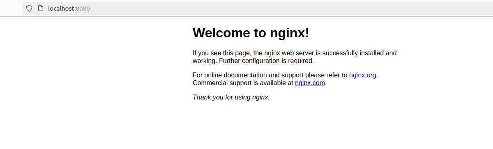
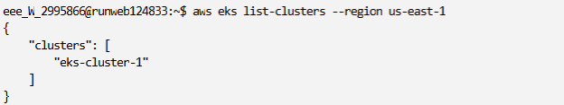
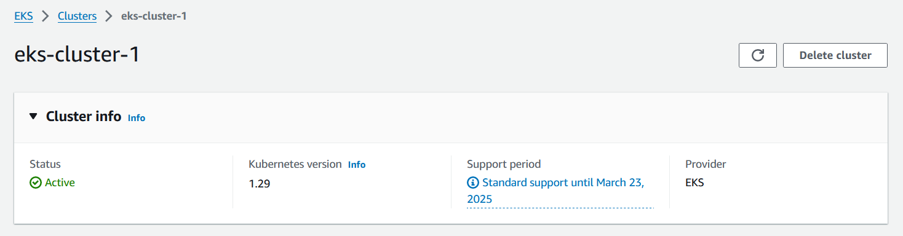
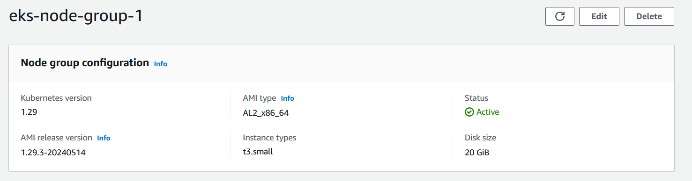
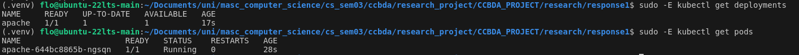
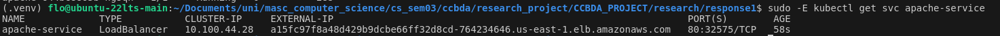
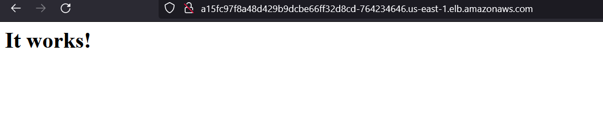

# CC-Research-tutorial2
A Docker example:
    
After running the described steps we saw the NGINX server running on port 8080.

Containers and Kubernetes:
    
The tutorial then gives an overview of the underlying concepts.

We learn that containers are utilized to package applications along with their dependencies into isolated, consistent units that run reliably across various computing environments. They are essential for supporting microservices architectures, which break down applications into smaller, independent services that can be developed, deployed, and scaled individually. This isolation makes containers ideal for DevOps practices and scalable application management, ensuring smooth operation in different environments.

Kubernetes is an open-source platform designed to orchestrate the deployment, scaling, and management of containerized applications. It introduces concepts like Pods (the smallest deployable units that group one or more containers), Services (which expose Pods and manage communication), and Deployments (which handle the scaling and management of Pods). Kubernetes automates maintaining the desired state of applications, managing updates, and ensuring high availability and scalability. This makes it highly effective for handling complex applications with numerous containers, providing a robust solution for container orchestration.

Setting up an Amazon EKS Cluster:

Now we follow the tutorial to create an Amazon EKS Cluster in practice.
After following the initial steps we finish the setup process and confirm via the Cli.

    
And after waiting another 5 minutes we see that the creation process is finished and the Cluster is active.

With the cluster created we add a node group configuration to run our Kubernetes applications.

Finally when we run the provided commands to create the actual pods according to the provided configuration. To ensure the configuration has worked we ran the following commands.

And we obtain the public IP to access our live page.

The result looks like the following.

Review and Grading:

The given tutorial gave us a good overview of Kubernetes and how to practically use it by utilizing Amazon Elastic Kubernetes Service. Concretely we followed a step-by-step introduction of how to run an NGINX server. We could follow most of the steps without relying on further research or debugging and especially the introduction to Docker and Kubernetes as well as the provided links were very helpful. More details or at least references to helpful tutorials on setting up the CLI could have been helpful. In total, the student lab and was good to follow and we got helpful insights into the topic at hand. We would grade it with a 9/10. We worked on it for around 3h.
