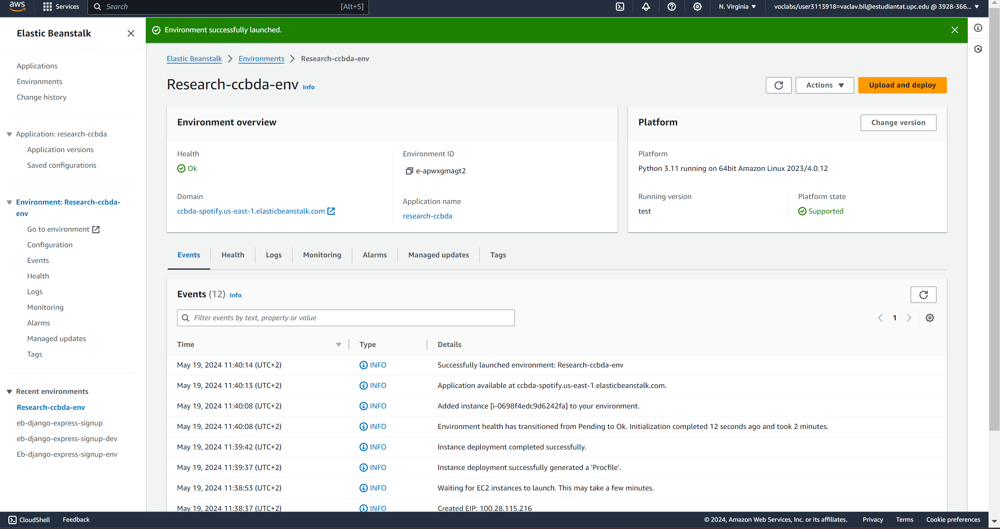
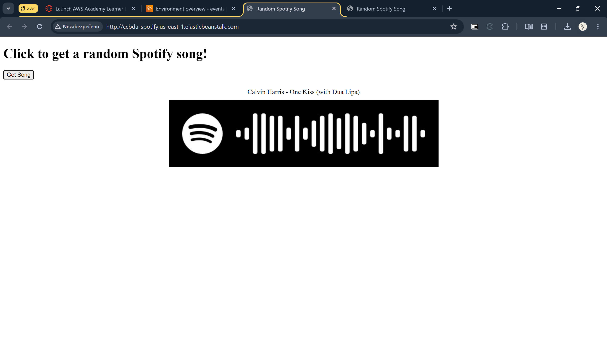

# Review - Research topic: Spotify Integrated App

Reviewer: [Václav Bílý](mailto:vaclav.bil@estudiantat.upc.edu)

## Process Feedback

### 1. Getting access token

Without any problems, I was able to get the access token. The instructions were clear and easy to follow.

### 2. Spinning up flask locally & getting a random song

The script worked as expected. I was able to get a random song with its artist and Spotify code. The rick roll feature
was a nice touch.

And music plays! 😁

Only suggestion I would do is to put the secrets to environment variables. It is not a good practice to have them
hardcoded in the code. It's a good practise because they can be committed to the repository by mistake.
(I know that because I did it more than once 🙈)

```python
# spotify_script.py

import os

CLIENT_ID = os.environ["SPOTIFY_CLIENT_ID"]
CLIENT_SECRET = os.environ["SPOTIFY_CLIENT_SECRET"]
```

### 3. Creating Elastic Beanstalk app

I was able to deploy the app to Elastic Beanstalk without any problems. The instructions were clear and easy to follow.
I used the AWS Management Console to deploy the app.

Maybe I would appreciate to use the eb cli for deployment, but it's not a big deal and AWS Management Console worked
fine and quickly.



### 4. Testing the deployed app

It just works! 😁 I was able to get a random song with its artist and Spotify code.


## Final thoughts

The research topic is well documented and easy to follow. The instructions are clear, concise, and fulfilled the
requirements. The code is minimal Flask application which works perfectly for showing the eas of the Spotify API usage
and I like the code generation idea to showcase the API capabilities.
The deployment to Elastic Beanstalk was successful. The rick roll feature is a nice touch.