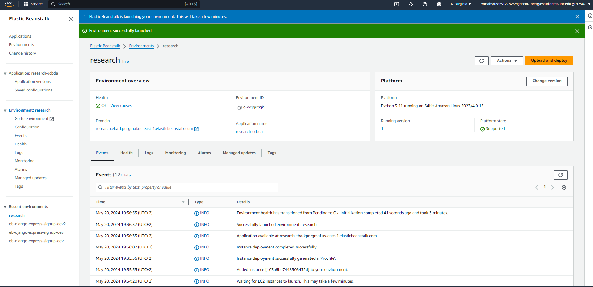

# Review of Team 6 Spotify Integrated App
<b> by Ignacio Lloret </b>

The tutorial is well-structured and engaging. It is straightforward, yet effectively demonstrates how to use the Spotify Integrated App, detailing its functionalities and potential use cases. The code is neatly organized and clearly explained, allowing me to quickly grasp each component and the overall workflow. Everything ran smoothly on the first attempt, and the tutorial notes the parts that take longer to execute, maintaining a high quality user experience throughout.

To further enhance the tutorial, consider adding personal insights and public feedback, as well as mentioning a few notable projects that utilize similar Spotify integration. Overall, it's a fantastic project—captivating and easy to follow.

## Grade
Attractiveness: 10/10
Understandability: 10/10

## Evidences 

Evidence on the elastic beanstalk environment: 

Evidence on the integrated app: 
