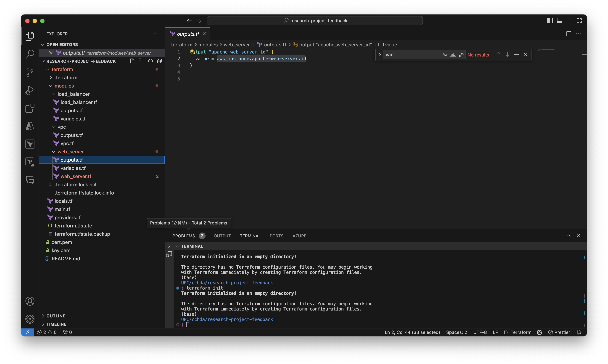
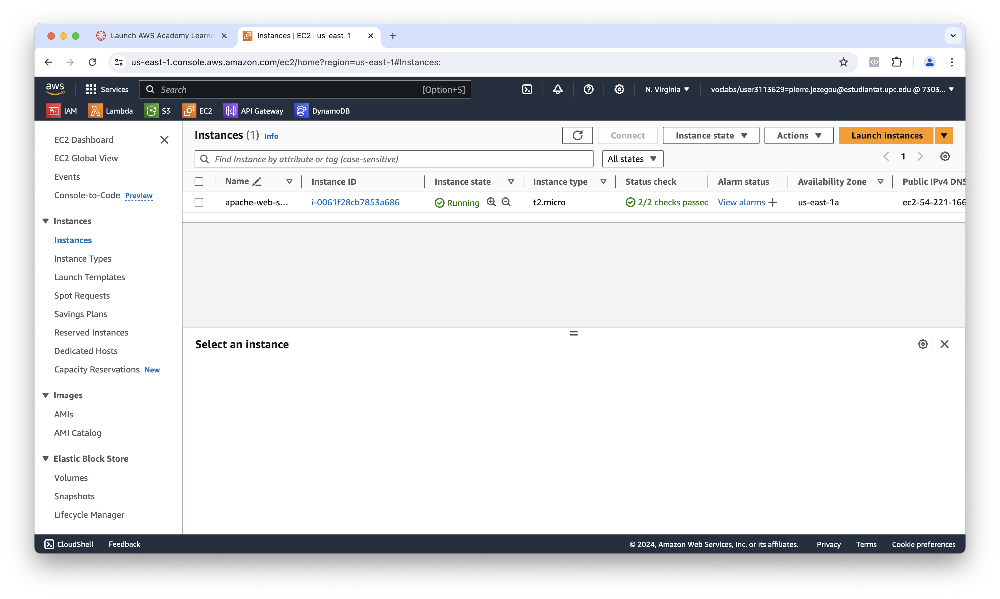

# Feedback for Team 7 -- Deploying Instances with Terraform in AWS

## Reproducibility

Here, we outline the steps we took during the tutorial and the actions we took to address the issues encountered.

1. **Installation of Terraform:** We began by installing `terraform` as per the instructions in the tutorial.

    

    

2. **Setting Up Terraform Files:** Following the tutorial, we prepared the necessary Terraform files.

    

3. **Initialization and Application:** We ran `terraform init` and `terraform apply` to create the resources.

    

    

    

4. **Troubleshooting:** We encountered an error during the `terraform apply` step.

    It appears that the tutorial was developed with a single Terraform file, leading to unresolved/undocumented references to variables in the instructions.

5. **Addressing the Issue:** After resolving these references, we successfully created the resources.

    

## Tutorial Feedback

Firstly, well done! Explaining `terraform`, a complex tool, in such a clear and structured manner is commendable. The tutorial is easy to follow, and the images significantly enhance understanding by visualizing the concepts.

### Areas for Improvement:
1. **Undefined Variable References:** The tutorial had undefined variable references, and it would be helpful to have more guidance on which snippets belong in which files.
2. **Example Complexity:** While using the old lab architecture as an example is appreciated, a simpler example might be more beneficial for learning `terraform`.

## Presentation Feedback

The presentation was excellent, with no criticisms. The slides were well-structured and easy to follow.

## Summary

Overall, the tutorial was highly effective, and we learned a lot. Despite the complexity of `terraform`, you did an outstanding job explaining the basics. We would appreciate more guidance on file organization and a simpler example for learning purposes. The presentation was very well executed.

**Grade: 10/10**