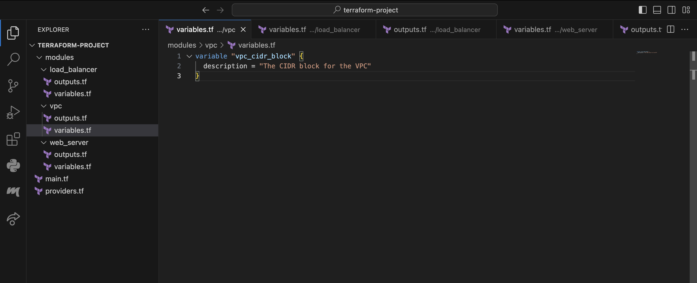
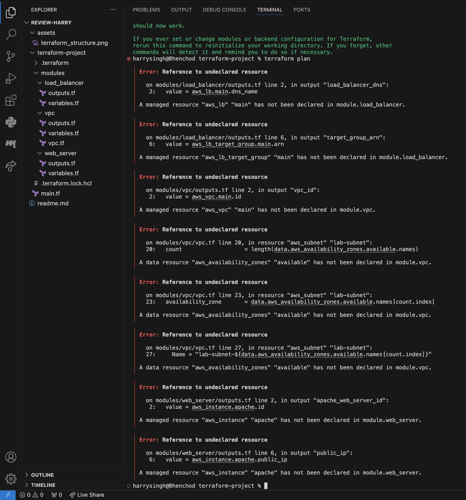
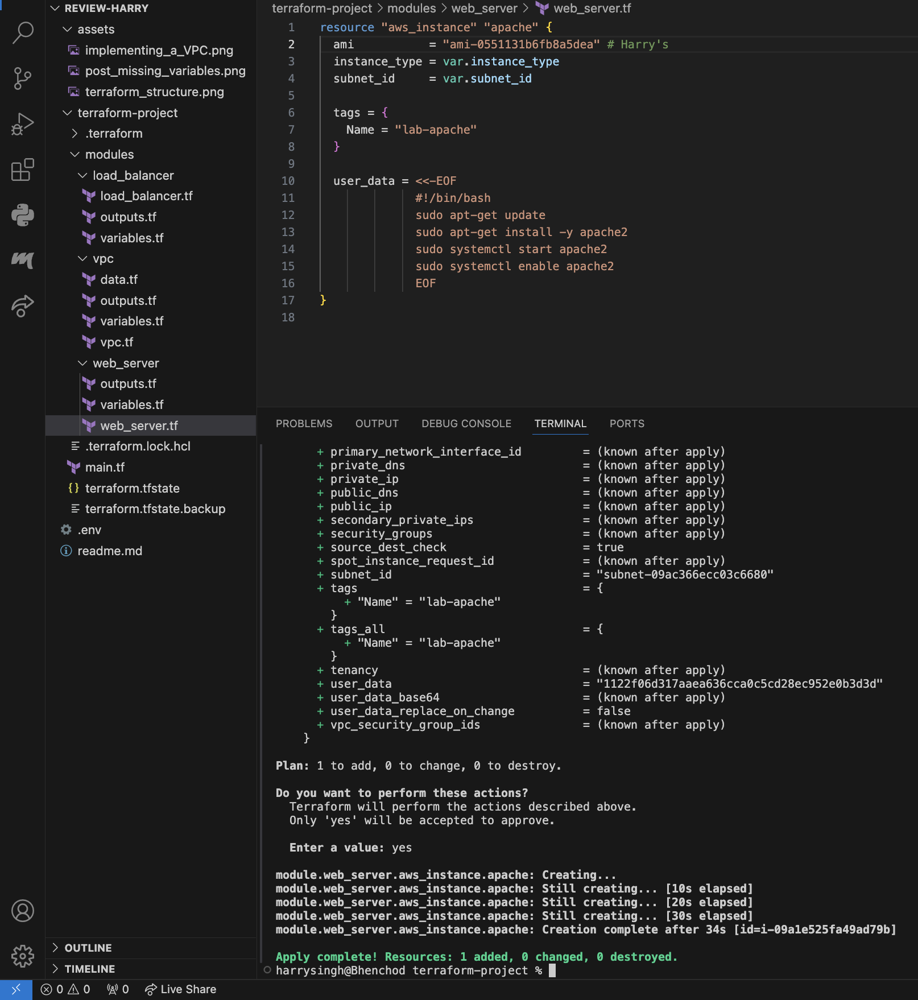
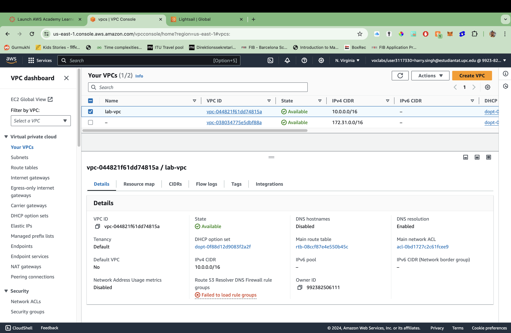
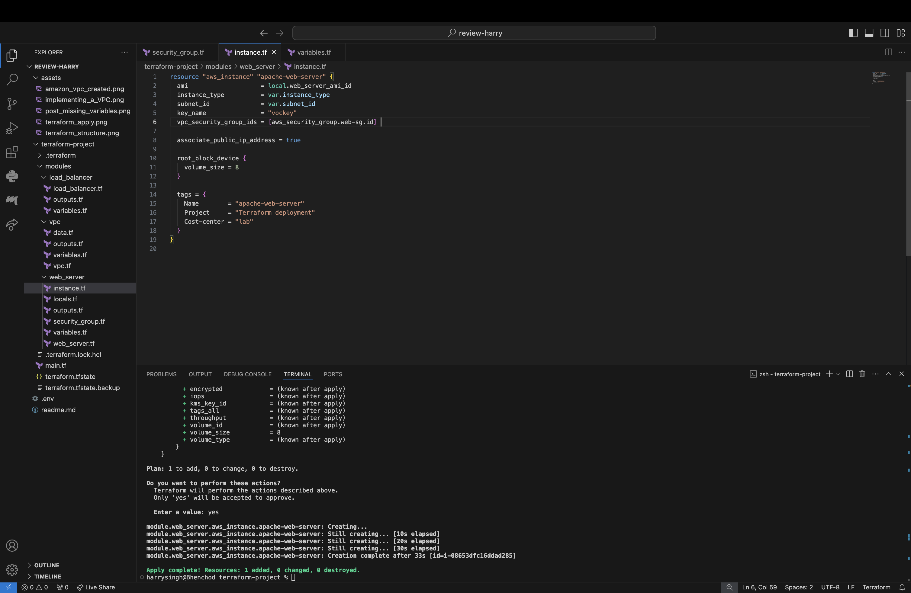
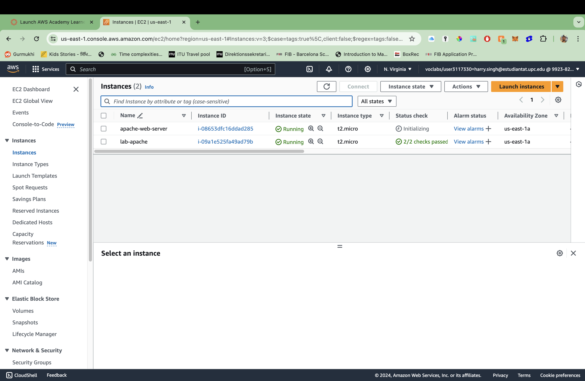
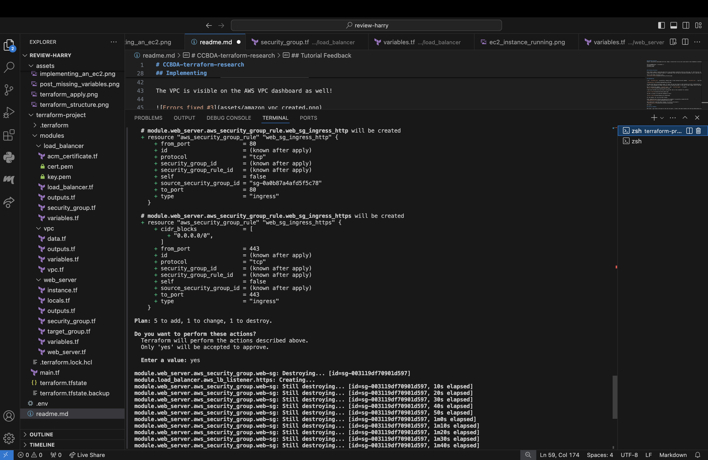
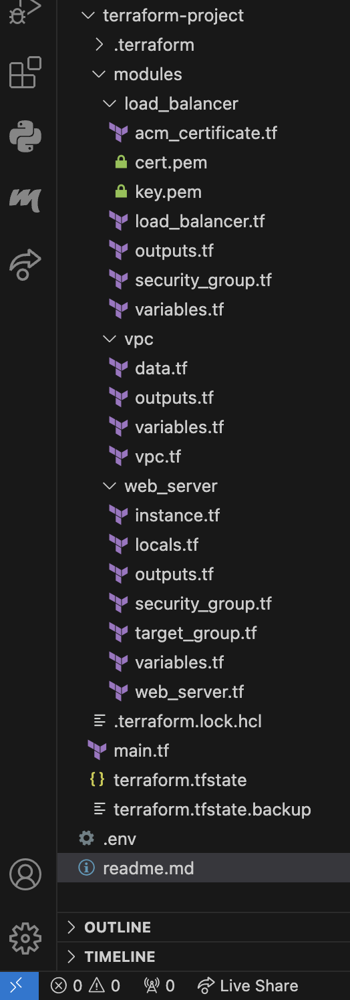

# CCBDA-terraform-research
A review conducted by Team 2 validators.

## Introduction
Very well written introduction to the key features. Short, precise and understandable for someone that has a technical background. We are not sure if it is well explained for people without a technological background or personal interest in this field, but we assume that is not the target group. We like that you provided links and for visual learners (like us, that you recommend a video tutorial). However, for this review we’ll follow your tutorial by text of course.

For your information, we are using *Macbook Pro M2 (ARM64)*.


## Download Terraform
Output, successfully downloaded with brew. Maybe, include that for mac users would need to have *homebrew* installed.

```
harrysingh@Bhenchod ~ % terraform -v
Terraform v1.8.4
on darwin_arm64
```


## Terraform Structure

First remark, maybe it could have been nice if you provided a repository which we could copy. So, that the user can simply download the folders with the files already filled in. We understand, that this may be a personal preference, just a side note. Good explaination still. 

This is the folder structure so far.



## Implementation

I ran ```terraform init```successfully, however when we tried running the next command ```terraform init```, we got the following errors.



It seems that there are multiple issues. It looks like you have forgot to add variables and after troubleshooting, We've managed to fix the files. We uploaded the *folder structure* with my working solution, if you want to take a deeper look in how exactly.

Now we ran the command ```terraform plan``` and ```terraform apply```. It works!


We went onto the AWS service and found a working AMI, here is the screenshot for creation:



The VPC is visible on the AWS VPC dashboard as well!



All the subnets, etc. has also been created.

After completing your tutorial and executing the commands  we successfully created the EC2.


And on AWS (don't mind the other instance, its from an old project.)


## Tutorial Feedback

Well done. We got stuck at the part at the last two parts. We think that we had some troubles with the key authorization (cert.pem and key.pem), after doing ```terraform apply``` it just seem to forever trying to destroy ```module.web_server.aws_security_group.web-sg:```.



and this is our folder structure so far:



Another note. In the beginning we faced errors with missing variables. 

### For next time
1. Try to give a better explaination on the folder structure, each file and its content.

2. Sometimes, something may be clear to you but for the reader it may not always be the same case. This was rather complex, but we know terraform is not easy.

## Feedback on your presentation
Nicely done! We asked a question about *is it possible to fix typo in terraform? Like volume, etc.* You guys answered *yes*, and of course after playing around with your tutorial, We see how easy it is to change around with the variables and redeploy.

# Grade

We give this a 8/10. There was some small missing things, but almost perfect. Very good job. This tutorial help us understand terraform a lot more and we see why it may be more tempting to use terraform for deployment.

Also, we spend around 4 hours on this.